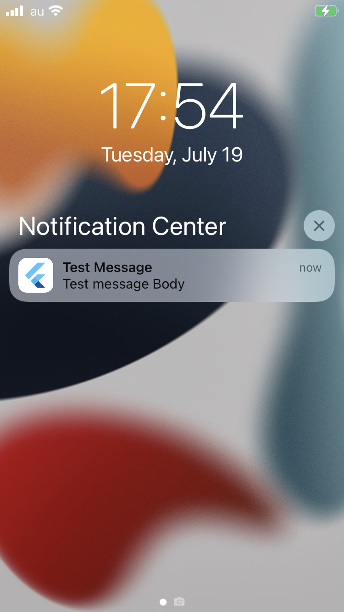

# test_flutter_fcm

Test Flutter with using Firebase Cloud Messaging Service.

## Getting Started

### Send from FCM Notification Compose

By select iOS/Android device, click `Send Test Message` from [Notification Compose](https://console.firebase.google.com/u/0/project/testflutterfcm-bac2a/notification/compose)

